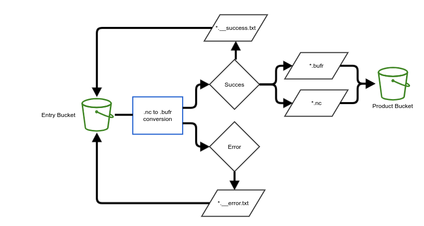

# WMO UASDC

This is the central repository for
the [World Meteorological Organization Uncrewed Aircraft System Demonstration Campaign project](https://community.wmo.int/en/uas-demonstration).
In this repository, you'll find a collection of code, example files, and documentation related to the campaign.
Please review the [UAS-DC Data Policy](https://community.wmo.int/en/uas-demonstration/data-policy) for additional
information and definitions.

## The UASDC Data Pipeline

Synoptic Data PBC is responsible for converting UASDC Provider netCDF data to BUFR and sharing these datasets to the
subscribed data users via the WIS2.0 Global Broker. This will be an automated pipeline existing within AWS. Therefore,
it is **imperative that individual data providers take it upon themselves to ensure the proper formatting and
standardization of their unique netCDF files**. There are many ways to interact with the Entry S3 Bucket, python and
boto3
being one that we will provide an example for.

### Data Pipeline Overview



#### Requirements

* A method to upload files to the Entry S3 bucket.
    * This can be done using the AWS CLI, the AWS SDK, or any of the other options listed below.
        * [AWS CLI](https://aws.amazon.com/cli/)
        * [Boto3 (python)](https://boto3.amazonaws.com/v1/documentation/api/latest/index.html)
        * [FileZilla Pro](https://filezillapro.com/docs/v3/cloud/configure-filezilla-pro-to-connect-to-s3/)
        * [Cyberduck](https://cyberduck.io/)
        * [S3 Browser](https://s3browser.com/)
        * other options may exist
* AWS Access Key ID and Secret Access Key
    * These credentials will be distributed upon acknowledgment of the UASDC Data Policy.
        * Please do not redistribute these keys to others outside the project.
        * The unique names of the Entry/input, and Product/Output S3 buckets will be distributed along with the access
          credentials.
* Adherence to the variable naming convention, the standard units, and the standard file naming structure for the netCDF
  files. Please find the standardized information for the netCDF files [here](raw_uas_to_netCDF/).

#### Workflow

1. Data Providers will upload their netCDF files to the Entry S3 bucket.
2. The data will be automatically converted to BUFR, transferred to the Product/output S3 Bucket and a notification
   message
   will be
   submitted to the WIS2 Global Broker. Both the original netCDF file and the generated BUFR file will be deposited, and
   available in the Product/output bucket for the duration of campaign.
    3. Note that since the data are 'recommended' rather than 'core' data, the data will not be made available to all
       WIS2 users.
    4. netCDF files that are unable to be converted to BUFR will not be transferred to the Product/output S3 bucket.
4. A status file will be generated and placed under the _processing_results/_ prefix of the Entry/input S3 bucket.
   Additionally, the generated status file will follow the naming convention of the original netCDF file and a suffix
   indicating the processing status of the file, 
ie '*__success.txt' or '*__error.txt'.
    5. The status file will contain a message indicating the success or error encountered during the processing of the
       original netCDF file and thus helpful for troubleshooting.

```text
For example, a netCDF file uploaded to the entry bucket with the following name:
UASDC_operatorID_airframeID_20230327025804Z.nc
will have one of the following status files generated in the entry bucket after processing:

processing_results/operatorID/airframeID/UASDC_operatorID_airframeID_20230327025804Z__success.txt
processing_results/operatorID/airframeID/UASDC_operatorID_airframeID_20230327025804Z__error.txt
```

#### Usage Notes

* Participants are only able to _Put_(upload), and _Get_(download) files from the S3 buckets.
    * Files will be overwritten if the same name is used.
* Data in the Entry S3 bucket will be automatically deleted after 7 days.
* Successfully converted files will be placed in the Product S3 bucket and will not be deleted.
* Files uploaded with additional directories in their file name will still be split out according to the basename of the
  file.
  _ie operatorID/airframeID/YYYY/MM/*filename*._
* A basic example of how to utilize the credentials, upload a file to an S3 bucket, and list files in the bucket is
  provided in the [upload_to_s3.py](raw_uas_to_netCDF/upload_to_s3.py) file.

## [Converting Raw UAS Data to netCDF](raw_uas_to_netCDF/)

**A necessary step for UASDC Data Providers is converting their unique individual files into the UASDC standardized
netCDF file**. It's imperative that each netCDF file adheres to the variable naming convention, the standard units, and
the standard file naming structure. Please find the standardized information for the netCDF
files [here](raw_uas_to_netCDF/).

[Example raw UAS to netCDF Conversion Script](raw_uas_to_netCDF/raw_csv_to_netCDF.py)

[Standardized netCDF Example File](nc2bufr/UASDC_operatorID_airframeID_20230327025804Z.nc)

## [Converting netCDF Data to BUFR](nc2bufr)

Synoptic Data will handle this part of the data pipeline. While providers are only expected to upload netCDF files to be
automatically converted, if an individual provider wants to verify that the netCDF to BUFR conversion for their data
will be correct prior to processing or as a
debugging step, please follow the instructions found [here](nc2bufr/). In this way, same code that is used by the
automated pipeline is available for manual use.

## Notes

- If coding support is needed, please refer to the WMO UASDC slack channel - the more activity the better!


